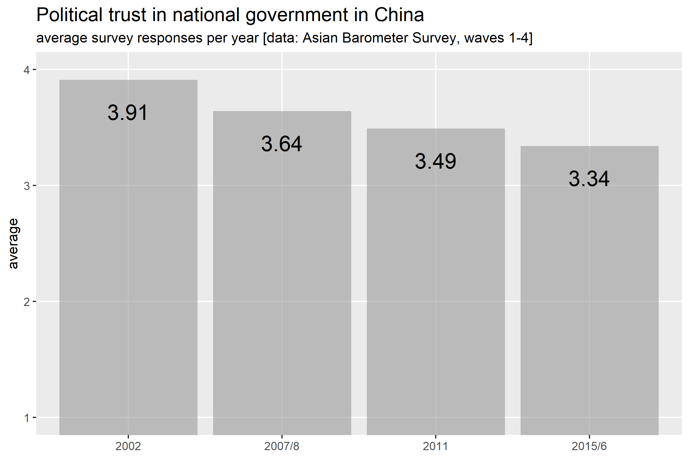

# Background
 This is an independent research project I conducted in the course "Workshop: society" at the university of St. Gallen.
 
 It uses all four waves of the Asian Barometer Survey, conducted by the College of Social Sciences, National Taiwan University Hu Fu Center for East Asia Democratic Studies.
 
 The data was kindly provided to me by its respective owners and will not be shared here.

